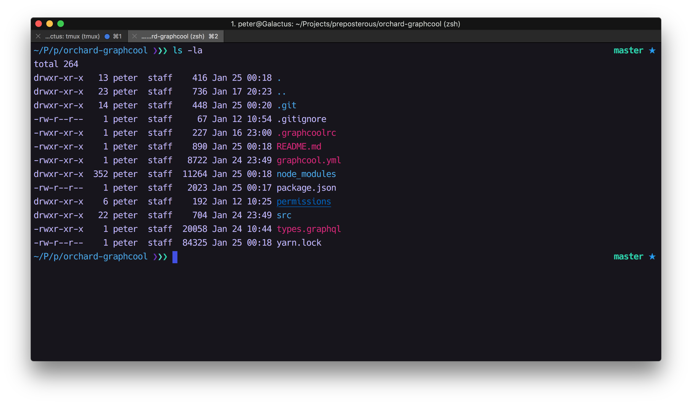

# Peterpme Dotfiles

These are _my_ dotfiles for how _I_ like to do things.

## New things I'm considering
- [coc.vim](https://github.com/neoclide/coc.nvim)
- [neoformat](https://github.com/sbdchd/neoformat)
- [z.lua](https://github.com/skywind3000/z.lua)

## Getting Started

```zsh

./first_time_setup.sh

```





## Investigating
- https://github.com/mhartington/nvim-typescript
- https://github.com/HerringtonDarkholme/yats.vim


- https://github.com/nicknisi/dotfiles
- https://github.com/paulirish/dotfiles
- https://github.com/mathiasbynens/dotfiles/blob/master/.macos
- https://github.com/anishathalye/dotbot
