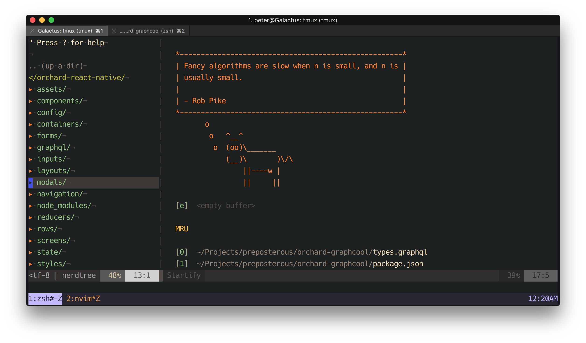
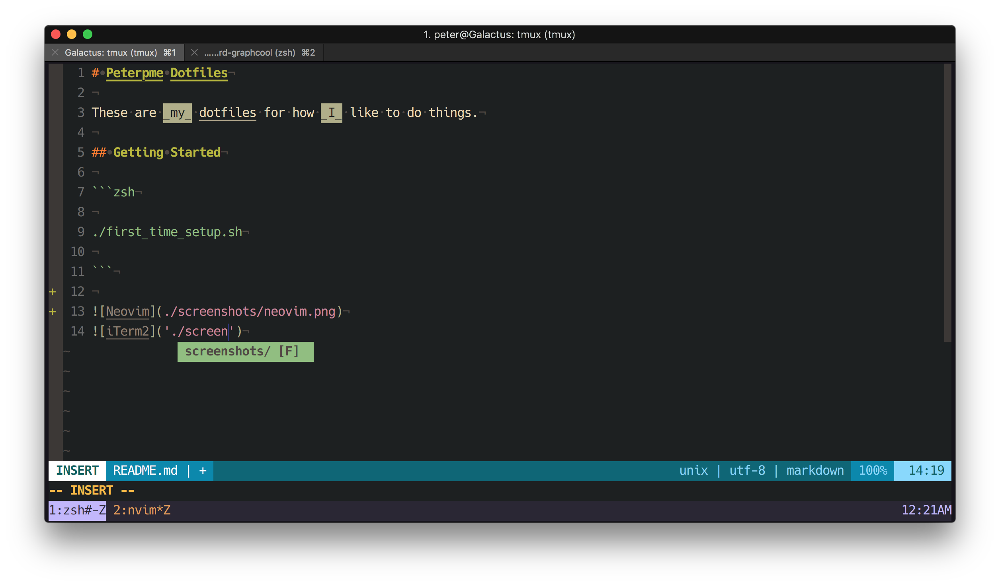

# Peterpme Dotfiles

These are _my_ dotfiles for how _I_ like to do things.

## New things I'm considering
- [coc.vim](https://github.com/neoclide/coc.nvim)
- [neoformat](https://github.com/sbdchd/neoformat)
- [z.lua](https://github.com/skywind3000/z.lua)

## Paths and extra alias

if you want to add paths and extra aliases, you can add them into `alias` and
`path`. this is loaded by `~/.zshenv`

## Getting Started

```zsh

./first_time_setup.sh

```

- zprezto repo - https://github.com/peterpme/prezto




## Investigating
- https://github.com/mhartington/nvim-typescript
- https://github.com/HerringtonDarkholme/yats.vim


- https://github.com/nicknisi/dotfiles
- https://github.com/paulirish/dotfiles
- https://github.com/mathiasbynens/dotfiles/blob/master/.macos
- https://github.com/anishathalye/dotbot
- https://github.com/caarlos0/dotfiles/blob/master/zsh/zshrc.symlink
- https://github.com/webpro/dotfiles/tree/master/config/hammerspoon
- https://github.com/bitprophet/dotfiles/tree/master/.hammerspoon
- *** awesome hammerspoon &* https://github.com/ashfinal/awesome-hammerspoon
- base16 black metal themes https://github.com/metalelf0/base16-black-metal-scheme


## TODO
- look into cron jobs and cleanup scripts
- copy over gitconfig correctly
- update gitconfig !!!  look at nicknisi and paul irish< matiasj>
- copy over sshconfig correctly
- copy over npmrc correcetly
- set caps to control in osx.sh settings
- find and setup popular sublime confi
- find and setup popular vscode config
- set up vimbox
- add macvim to brew cask
- correctly setup iCloud for important files / folders / certs
- look at AUTH SOCK stuff https://github.com/akashin/dotfiles/blob/master/zsh/zshrc.symlink#L52
- look into why .npmrc needs to be EXPORTED
- heroku autocomplete
- set up a cron job that checks for latest version of reason-language-server
  (and other bins to update them)


## Vim and Neovim Setup

[Neovim](https://neovim.io/) is a fork and drop-in replacement for vim. in most cases, you would not notice a difference between the two, other than Neovim allows plugins to run asynchronously so that they do not freeze the editor, which is the main reason I have switched over to it. Vim and Neovim both use Vimscript and most plugins will work in both (all of the plugins I use do work in both Vim and Neovim). For this reason, they share the same configuration files in this setup. Neovim uses the [XDG base directory specification](http://standards.freedesktop.org/basedir-spec/basedir-spec-latest.html) which means it won't look for a `.vimrc` in your home directory. Instead, its configuration looks like the following:

|                         | Vim        | Neovim                    |
|-------------------------|------------|---------------------------|
| Main Configuration File  | `~/.vimrc` | `~/.config/nvim/init.vim` |
| Configuration directory | `~/.vim`   | `~/.config/nvim`          |
