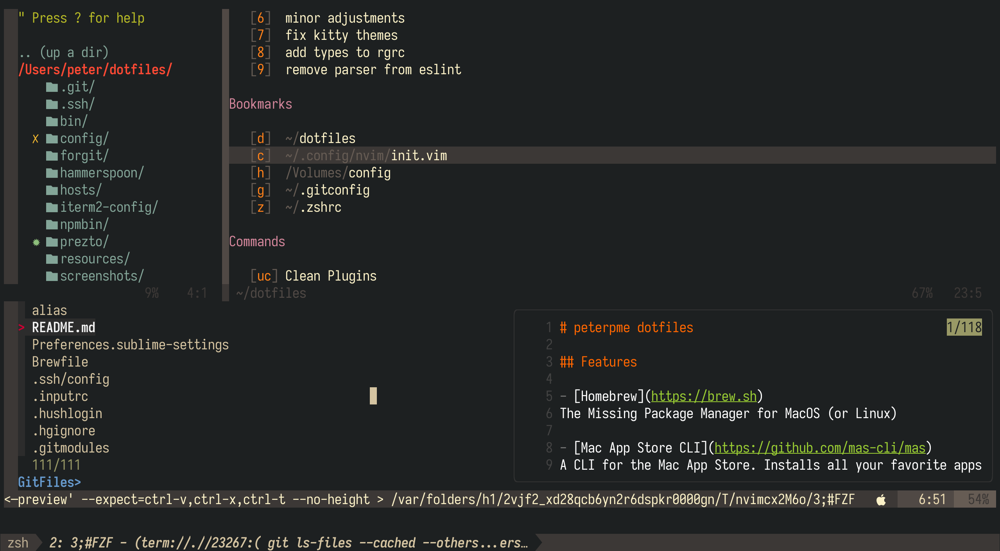

# Peter's dotfiles

Dotfiles and automation that make my life easier. Take a peek!

- [Homebrew](https://brew.sh)
The Missing Package Manager for MacOS (or Linux)

- [Mac App Store CLI](https://github.com/mas-cli/mas)
A CLI for the Mac App Store. Installs all your favorite apps in just 1 line!

- [Hammerspoon](https://github.com/Hammerspoon/hammerspoon)
Staggeringly powerful MacOS desktop automation with Lua

- [Neovim](https://neovim.io/)
A modern, ground up rewrite of Vim


- [Kitty](https://sw.kovidgoyal.net/kitty/)
A fast, GPU based terminal alternative to iTerm

- [Tmux](https://github.com/tmux/tmux/wiki)
Create, split, save, move terminal tabs easily all within one window.


- [Fzf](https://github.com/junegunn/fzf)
The fastest way to search for ANYTHING on your computer

- [Forgit](https://github.com/wfxr/forgit)
Use git interactively. Powered by fzf


- [Prezto](https://github.com/sorin-ionescu/prezto)
A lightweight zsh configuration framework with sensible defaults. It's fast, too!

- [PowerLevel10k](https://github.com/romkatv/powerlevel10k)
A zsh theme that emphasizes speed, flexibility and an out-of-the-box experience

## Screenshots





## Getting Started

Check out `./first_time_setup.sh` and see what we're doing. The steps are relatively straight forward:
- Install Homebrew & dependencies
- Install Xcode and Xcode CLI tools
- Setup symlinks and config

```zsh
source first_time_setup.sh
```

## Vim and Neovim Setup

[Neovim](https://neovim.io/) is a fork and drop-in replacement for vim. in most cases, you would not notice a difference between the two, other than Neovim allows plugins to run asynchronously so that they do not freeze the editor, which is the main reason I have switched over to it. Vim and Neovim both use Vimscript and most plugins will work in both (all of the plugins I use do work in both Vim and Neovim). For this reason, they share the same configuration files in this setup. Neovim uses the [XDG base directory specification](http://standards.freedesktop.org/basedir-spec/basedir-spec-latest.html) which means it won't look for a `.vimrc` in your home directory. Instead, its configuration looks like the following:

|                         | Vim        | Neovim                    |
| ----------------------- | ---------- | ------------------------- |
| Main Configuration File | `~/.vimrc` | `~/.config/nvim/init.vim` |
| Configuration directory | `~/.vim`   | `~/.config/nvim`          |

## Thanks

I've been working on my dotfiles for over 8 years. A lot of it is thanks to the community and some of my favorite people / projects:

- [Maximum Awesome](https://github.com/square/maximum-awesome)
- [Paul Irish Dotfiles](https://github.com/paulirish/dotfiles)
- [Nick Nisi Dotfiles](https://github.com/nicknisi/dotfiles)
- [Mathias Bynens Dotfiles](https://github.com/mathiasbynens/dotfiles)

## Paths and extra alias

if you want to add paths and extra aliases, you can add them into `alias` and
`path`. this is loaded by `~/.zshenv`

## Investigating

- https://github.com/mhartington/nvim-typescript
- https://github.com/HerringtonDarkholme/yats.vim

- https://github.com/nicknisi/dotfiles
- https://github.com/paulirish/dotfiles
- https://github.com/mathiasbynens/dotfiles/blob/master/.macos
- https://github.com/anishathalye/dotbot
- https://github.com/caarlos0/dotfiles/blob/master/zsh/zshrc.symlink
- https://github.com/webpro/dotfiles/tree/master/config/hammerspoon
- https://github.com/bitprophet/dotfiles/tree/master/.hammerspoon
- _\*\* awesome hammerspoon &_ https://github.com/ashfinal/awesome-hammerspoon
- base16 black metal themes https://github.com/metalelf0/base16-black-metal-scheme
- https://github.com/norcalli/nvim-colorizer.lua/blob/master/README.md
- https://github.com/makovich/dotfiles/tree/master/dns dns stuff


## TODO

- add nvim +PlugInstall to isntall plugs
- reverse order in the file to install other shit frist
- figure out broken brew things
- install node via fnm after brew installing it
- manually open hammerspoon and set open at login

- look into cron jobs and cleanup scripts
- copy over gitconfig correctly
- update gitconfig !!! look at nicknisi and paul irish< matiasj>
- copy over sshconfig correctly
- copy over npmrc correcetly
- set caps to control in osx.sh settings
- find and setup popular sublime confi
- find and setup popular vscode config
- set up vimbox
- add macvim to brew cask
- correctly setup iCloud for important files / folders / certs
- look at AUTH SOCK stuff https://github.com/akashin/dotfiles/blob/master/zsh/zshrc.symlink#L52
- look into why .npmrc needs to be EXPORTED
- heroku autocomplete
- set up a cron job that checks for latest version of reason-language-server
  (and other bins to update them)

